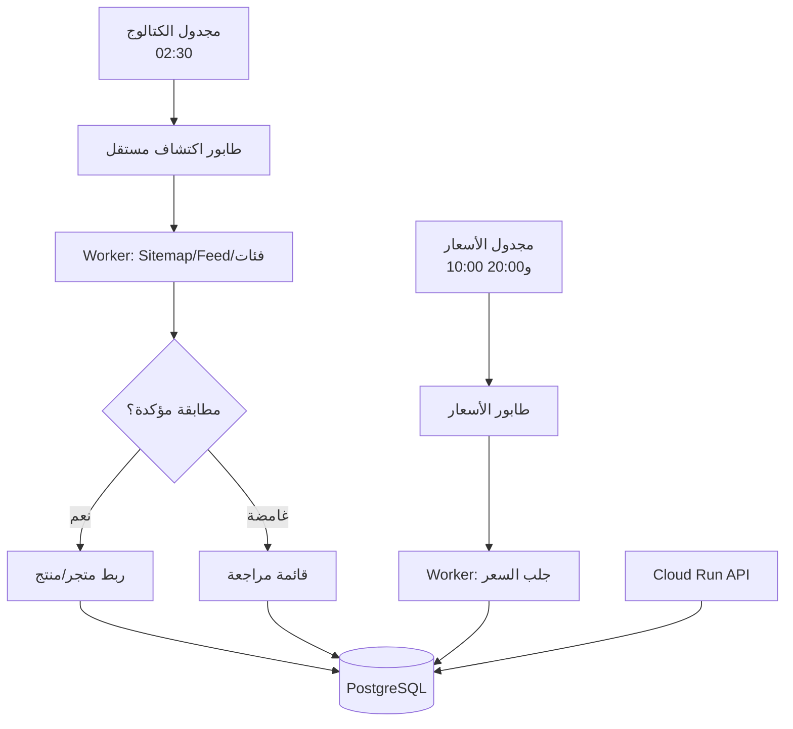

# معمارية سعرلي 0.5.1

## الفصل التشغيلي

- السعر والكتالوج يستخدمان جدولين وطابورين ومهام وسجلات تشغيل منفصلة.
- اكتشاف رابط لا ينشر سعرًا؛ الرابط المؤكد يدخل دورة الأسعار التالية.
- الكاش والتقسيط يظلان في سجلين منفصلين، ولا تتحول مدة الضمان إلى تقسيط.
- مجدول الكتالوج لا يستطيع تعديل مجدول الأسعار.

## حالات المرشح

- `already_mapped`: الرابط موجود فعليًا.
- `auto_mapped`: تطابق قوي ونُشئ/حُدّث الربط.
- `needs_review`: أفضل تطابق محتمل لكنه غير آمن للنشر.
- `pending_match`: لا يوجد تطابق كافٍ.
- `provisional_product`: منتج GTIN جديد ينتظر متجرًا ثانيًا.

## الحماية

- allowlist مستقل لكل متجر ومنع SSRF والتحويلات خارج النطاق.
- احترام `robots.txt` دائمًا ما لم يكن الطلب نفسه لقراءة robots.
- لا تسجيل دخول، لا CAPTCHA bypass، ولا API خاص.
- حد أقصى 12 مصدرًا و2,000 مرشح للمتجر في الدورة.
- تزامن واحد لطابور الاكتشاف حتى لا يؤثر في دورة الأسعار.
- Firestore مصدر رجوع آمن: يسجل المرشحين فقط ولا ينشر ربطًا تلقائيًا.
