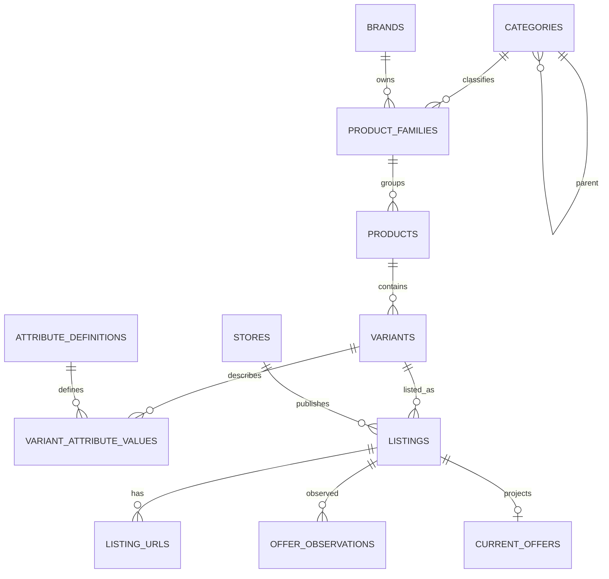

# نموذج قاعدة بيانات سعرلي Core V2

## مصدر الحقيقة

قاعدة PostgreSQL واحدة مقسمة إلى مجالات واضحة. لا تملك واجهة البحث أو أي
فهرس خارجي بيانات أصلية؛ يمكن إعادة بنائها دائمًا من الجداول الأساسية.

## المجالات

- `reference`: الدول والعملات.
- `catalog`: الفئات، الماركات، عائلات المنتجات، المنتجات، النسخ، المعرفات والمواصفات.
- `merchant`: المتاجر، البائعون، العروض التجارية وروابطها.
- `pricing`: أحدث العروض وسجل الأسعار والتقسيط القابل للتتبع.
- `ingestion`: الاكتشاف والاستيراد والأدلة الخام وتسليم المهام.
- `operations`: دورات تحديث الأسعار ومهامها.
- `governance`: المراجعات والتدقيق وTransactional Outbox.
- `analytics`: درجات الطلب المستخدمة لترتيب الاختيارات.

## تسلسل اختيار المنتج

`category -> subcategory -> brand -> product_family -> product -> variant attributes`

مثال:

`الموبايلات -> هواتف ذكية -> Apple -> iPhone 17 -> iPhone 17 Pro -> 256GB / 12GB`

المواصفات ليست أعمدة ثابتة لكل الفئات. يعرفها
`catalog.attribute_definitions` وتخزن القيم ذات النوع الصحيح في
`catalog.variant_attribute_values`، ولذلك يمكن إضافة فئة جديدة بدون تغيير
المخطط.

## الأسعار والروابط

- `merchant.listings` هو المالك الوحيد لعلاقة المتجر بالنسخة.
- `merchant.listing_urls` يحتفظ بالرابط الأساسي والتحويلات والروابط المكسورة.
- `pricing.offer_observations` سجل append-only لكل تغير سعر.
- `pricing.current_offers` Projection سريع يشير إلى أحدث مشاهدة.
- `pricing.public_offer_table` هو عقد جدول المتجر والسعر والشحن والتكلفة النهائية.
- البلد يتبع المتجر، والعملة تتبع العرض؛ المنتج نفسه عالمي.

## قواعد التشغيل

1. لا يكتب المستخدم أو الواجهة مباشرة في PostgreSQL.
2. كل جلب أو استيراد له Idempotency key أو هوية مصدر ثابتة.
3. سجل السعر لا يعدل ولا يحذف من مسار التشغيل.
4. العروض المحجوبة لا تظهر، والعروض قيد المراجعة لا تدخل الترتيب.
5. Raw HTML وJSON تحفظ في Object Storage؛ PostgreSQL يحتفظ بالبصمة والرابط فقط.
6. أي فهرس بحث أو Cache أو تقرير تغطية هو Projection قابل لإعادة البناء.
